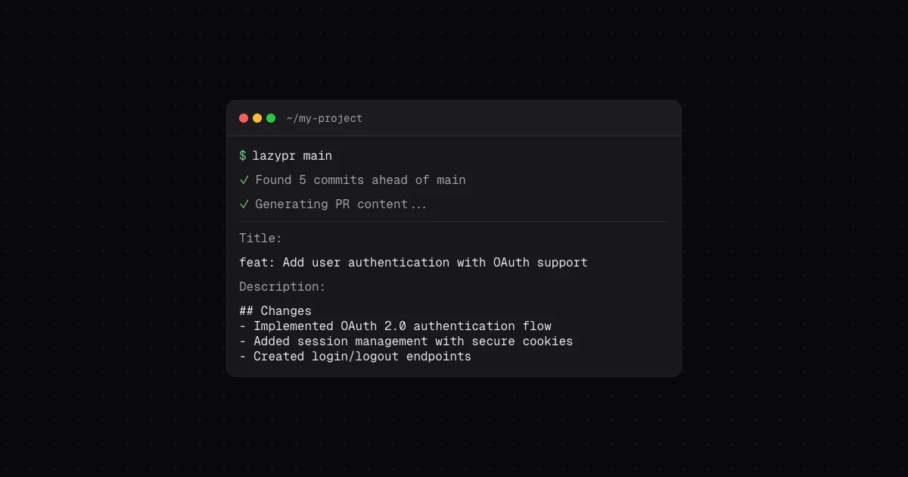

[](https://github.com/R4ULtv/lazypr/actions/workflows/test.yml)
[](https://www.npmjs.com/package/lazypr)
[](./LICENSE)
[](https://nodejs.org)

Generate clean, consistent pull request titles and descriptions from your Git history with AI.

lazypr reads the commits on your current branch, compares them with a target branch, and generates a ready-to-review PR title, description, and labels. It supports several AI providers, existing GitHub PR templates, multiple output languages, and a short `lzp` command alias.

## Contents

- [Features](#features)
- [Requirements](#requirements)
- [Installation](#installation)
- [Quick start](#quick-start)
- [How it works](#how-it-works)
- [CLI reference](#cli-reference)
- [Configuration](#configuration)
- [AI providers](#ai-providers)
- [PR templates](#pr-templates)
- [Commit filtering](#commit-filtering)
- [GitHub CLI integration](#github-cli-integration)
- [Troubleshooting](#troubleshooting)
- [Development](#development)

## Features

- Groq, Cerebras, Google Gemini, OpenAI, and OpenAI-compatible APIs
- Interactive configuration with masked API-key input
- Smart filtering for merge, dependency-update, and formatting-only commits
- Support for existing GitHub pull request templates
- Output in 13 languages
- Custom context and label guidance
- Optional token-usage details
- Generation of a ready-to-run `gh pr create` command
- `lazypr` and `lzp` command names

## Requirements

- [Node.js](https://nodejs.org) 22 or newer
- Git
- A repository with at least one commit on the current branch that is not on the target branch
- An API key for the selected hosted AI provider; local OpenAI-compatible endpoints may not require one

The GitHub CLI is only required when using the `--gh` option.

## Installation

Install lazypr globally with npm:

```bash
npm install -g lazypr
```

Then verify the installation:

```bash
lazypr --version
# or use the short alias
lzp --version
```

## Quick start

1. Open the interactive configuration menu:

   ```bash
   lazypr config
   ```

2. Choose a provider and model, then add the provider's API key. API keys entered through the interactive menu are masked and do not appear in your shell history.

3. From a feature branch, generate a PR against `main`:

   ```bash
   lazypr
   ```

   To compare against a different branch, pass it as the first argument:

   ```bash
   lazypr develop
   ```

4. Review the generated content. lazypr can copy the title and description to your clipboard, but AI output should always be checked before publishing.

## How it works

For a command such as `lazypr main`, lazypr:

1. Finds commits in `main..HEAD`.
2. Removes common noise commits unless filtering is disabled.
3. Loads an optional PR template and any configured generation context.
4. Sends the commit messages and guidance to the selected AI model.
5. Validates and displays the generated title, description, and suggested labels.
6. Offers to copy the result, or a `gh pr create` command when `--gh` is used.

Only the current branch name, commit messages, configuration guidance, and the contents of a selected PR template are used to generate the prompt. lazypr does not analyze the repository's source files.

## CLI reference

```text
lazypr [target] [options]
```

`target` is the branch the current branch will be merged into. It defaults to `DEFAULT_BRANCH`, which is `main` unless changed.

| Option                    | Description                                                                         |
| ------------------------- | ----------------------------------------------------------------------------------- |
| `-t, --template [name]`   | Use a discovered PR template. Omit the name to select interactively.                |
| `-u, --usage`             | Display input, output, and total token usage.                                       |
| `-l, --locale <language>` | Override the configured output language for this run.                               |
| `--no-filter`             | Include commits normally removed by smart filtering.                                |
| `--gh`                    | Generate a `gh pr create` command instead of copying the title and body separately. |
| `-c, --context <text>`    | Add guidance for this run, overriding configured context.                           |
| `-h, --help`              | Show command help.                                                                  |
| `-V, --version`           | Show the installed version.                                                         |

Examples:

```bash
# Compare the current branch with main
lazypr

# Compare with develop and include every commit
lazypr develop --no-filter

# Generate in Italian with extra guidance
lazypr --locale it --context "Focus on the user-facing changes"

# Select a template interactively
lazypr --template

# Use a named template and show token usage
lazypr --template bug_fix --usage

# Generate a GitHub CLI command
lazypr main --gh
```

## Configuration

Run `lazypr config` for the recommended interactive setup. The menu lets you edit the provider and model together, enter a masked API key, change general settings, and inspect the current configuration.

For scripts and dotfiles, use the configuration subcommands:

```bash
lazypr config list
lazypr config get PROVIDER
lazypr config set LOCALE=it
lazypr config remove CONTEXT
```

The `set` command requires `KEY=VALUE` as one argument. Quote the whole argument when the value contains spaces:

```bash
lazypr config set "CONTEXT=Keep the description concise and mention breaking changes"
```

> API keys passed to `lazypr config set` can remain in shell history. Prefer `lazypr config` for secret entry.

Configuration is stored in `~/.lazypr` (for example, `C:\Users\YourName\.lazypr` on Windows). The file uses one `KEY=value` entry per line and is created with owner-only permissions on supported systems.

### Settings reference

| Key                            | Default              | Description                                            |
| ------------------------------ | -------------------- | ------------------------------------------------------ |
| `PROVIDER`                     | `groq`               | `groq`, `cerebras`, `google`, or `openai`              |
| `MODEL`                        | `openai/gpt-oss-20b` | Model ID sent to the selected provider                 |
| `GROQ_API_KEY`                 | empty                | API key used by Groq                                   |
| `CEREBRAS_API_KEY`             | empty                | API key used by Cerebras                               |
| `GOOGLE_GENERATIVE_AI_API_KEY` | empty                | API key used by Google Gemini                          |
| `OPENAI_API_KEY`               | empty                | API key used by OpenAI or a compatible endpoint        |
| `OPENAI_BASE_URL`              | empty                | Base URL for an OpenAI-compatible API                  |
| `DEFAULT_BRANCH`               | `main`               | Target branch used when no target argument is provided |
| `LOCALE`                       | `en`                 | Language used for generated PR content                 |
| `FILTER_COMMITS`               | `true`               | Whether smart commit filtering is enabled              |
| `CONTEXT`                      | empty                | Persistent generation guidance, up to 200 characters   |
| `CUSTOM_LABELS`                | empty                | Comma-separated labels the model may suggest           |
| `MAX_RETRIES`                  | `2`                  | Number of model request retries; may be `0`            |
| `TIMEOUT`                      | `10000`              | Request timeout in milliseconds                        |

Supported locale codes are `en`, `es`, `pt`, `fr`, `de`, `it`, `ja`, `ko`, `zh`, `ru`, `nl`, `pl`, and `tr`.

Custom labels must start with a letter and may contain letters, numbers, hyphens, and underscores. Up to 17 custom labels can be added.

## AI providers

| Provider      | `PROVIDER` | API-key setting                | Get a key                                                  |
| ------------- | ---------- | ------------------------------ | ---------------------------------------------------------- |
| Groq          | `groq`     | `GROQ_API_KEY`                 | [Groq Console](https://console.groq.com/keys)              |
| Cerebras      | `cerebras` | `CEREBRAS_API_KEY`             | [Cerebras Cloud](https://cloud.cerebras.ai/)               |
| Google Gemini | `google`   | `GOOGLE_GENERATIVE_AI_API_KEY` | [Google AI Studio](https://aistudio.google.com/app/apikey) |
| OpenAI        | `openai`   | `OPENAI_API_KEY`               | [OpenAI API keys](https://platform.openai.com/api-keys)    |

The interactive menu includes a small curated model list and a custom model option. Model catalogs change, so any non-empty model ID can also be configured directly:

```bash
lazypr config set PROVIDER=cerebras
lazypr config set MODEL=gpt-oss-120b
```

### OpenAI-compatible and local APIs

Services such as Ollama, LM Studio, and other OpenAI-compatible APIs can be used through the `openai` provider:

```bash
lazypr config set PROVIDER=openai
lazypr config set OPENAI_BASE_URL=http://localhost:11434/v1
lazypr config set MODEL=llama3.2
```

`OPENAI_API_KEY` is optional for the `openai` provider so local endpoints that do not authenticate can work. Set it if your endpoint requires authentication.

The selected model must support structured object output. If a custom model repeatedly returns invalid output, try a model with reliable JSON or structured-output support.

## PR templates

lazypr discovers Markdown templates in these locations, using either lowercase or uppercase filenames where shown:

```text
.github/pull_request_template.md
.github/PULL_REQUEST_TEMPLATE.md
.github/pull_request_template/*.md
.github/PULL_REQUEST_TEMPLATE/*.md
docs/pull_request_template.md
docs/PULL_REQUEST_TEMPLATE.md
```

Use `--template` without a value to choose from discovered templates, or pass a template name or path:

```bash
lazypr --template
lazypr --template feature
lazypr --template .github/PULL_REQUEST_TEMPLATE/bug_fix.md
```

The model is instructed to preserve the template's headings, sections, checkboxes, and formatting. YAML frontmatter between `---` markers at the top of a template is ignored.

## Commit filtering

Smart filtering is enabled by default. It excludes commits whose messages look like:

- merge commits, such as `Merge pull request #42`
- dependency updates, including common Dependabot and Renovate messages
- formatting- or lint-only changes

Disable filtering for one run:

```bash
lazypr --no-filter
```

Or disable it persistently:

```bash
lazypr config set FILTER_COMMITS=false
```

Filtering is based on commit-message patterns. Use `--no-filter` if meaningful work was excluded because its message matched one of those patterns.

## GitHub CLI integration

With [GitHub CLI](https://cli.github.com/) installed and authenticated, `--gh` builds a shell-safe command containing the generated base branch, title, description, and labels:

```bash
lazypr main --gh
```

lazypr asks whether to copy the generated command. Review it, then paste it into a POSIX-compatible shell to create the pull request. The command is generated but not executed automatically.

## Troubleshooting

### No commits found

lazypr reads `target..HEAD`. Make sure you are on the feature branch, the target branch exists locally or as a listed remote branch, and the current branch has commits not present on the target.

If the message says every commit was filtered, retry with:

```bash
lazypr --no-filter
```

### The target branch is wrong or missing

Pass the branch explicitly or update the default:

```bash
lazypr develop
lazypr config set DEFAULT_BRANCH=develop
```

When the configured target is missing or matches the current branch, lazypr offers an interactive branch selector.

### An API key is missing

Open `lazypr config`, choose **API key**, and enter the key for the active provider. You can confirm the active provider and masked configuration with:

```bash
lazypr config list
```

### Requests time out or fail repeatedly

Increase the timeout or retry count, then confirm that the configured provider, model, endpoint, and API key belong together:

```bash
lazypr config set TIMEOUT=30000
lazypr config set MAX_RETRIES=4
```

For local endpoints, also confirm that the server is running and that `OPENAI_BASE_URL` includes the expected `/v1` path.

### Clipboard access fails

The generated title and description remain visible in the terminal and can be copied manually. Clipboard access may not be available in headless or remote environments.

For bugs and feature requests, [open a GitHub issue](https://github.com/R4ULtv/lazypr/issues).

## Development

This repository uses [Bun](https://bun.sh/) for development:

```bash
bun install
bun run dev --help
bun test
bun run lint
bun run format
bun run build
```

The published CLI targets Node.js 22 or newer.

## Contributing

Issues and pull requests are welcome. Please keep changes focused, add or update tests when behavior changes, and run the development checks before opening a PR. All contributors must follow the [Code of Conduct](./CODE_OF_CONDUCT.md).

## License

[MIT](./LICENSE) © Raul Carini
